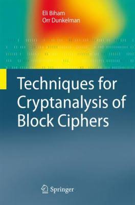
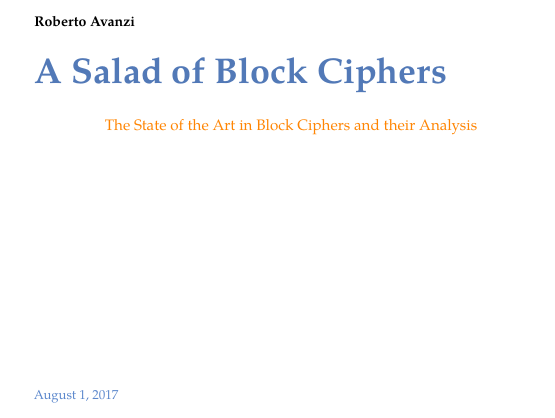

# Cryptanalysis

Learn about cryptographic attacks and how to apply this knowledge to design secure cryptographic primitives.

## Lecturer

### Ling Song

## Goals and Contents

This course aims to give you in-depth knowledge about the cryptographic attacks, focusing on cryptanalysis of symmetric ciphers and asymmetric ciphers. More precisely, this course covers the following topics:

* Introduction to Cryptanalysis 
  * Kerckhoffs' principle 
  * Notions of security: confidentiality, integrety, authenticity and more
  * Models of attack
  * Targets of attack
  * Theoretic attacks vs. practical attacks
* Cryptanalysis of block ciphers
  * Meet-in-the-Middle attack (TMTO)
  * Basic differential analysis
  * Basic linear analysis
  * Wide-trail strategy and AES
  * More (optional)
    * Integral cryptanalysis
    * Truncated differential attack
    * Higher order differential attack
    * Boomerang and rectangle attacks
    * Impossible differential attack
    * Multi dimensional linear attack
    * Zero-correlation linear attack
    * Division property
    * Demirci-Selcuk MitM attack
    * Subspace trail cryptanalysis 
* Cryptanalysis of stream ciphers
  * Guess-and-determine attack on stream ciphers
  * Time-Memory-Data trade off attack
  * Linear distinguisher and correlation attacks
* Cryptanalysis of hash functions
  * Birthday attacks 
  * MD and Sponge
  * Differential cryptanalysis and collision attacks
  * Meet-in-the-Middle Pre-image attack
* Computer-aided cryptanalysis
  * MILP-based cryptanalysis
  * SAT-based cryptanalysis
* Algebraic cryptanalysis
  * Interpolation attack
  * Cube attacks and Higher order differential attack
  * Linearization 
* Merkle-Hellman Knapsack
* Difie-Hellman Key Exchange and MitM
* Discrete Log algorithms
  * Baby-step giant-step          
* Factoring algorithms  
  * Dixon’s Algorithm 
  * Quadratic Sieve
* Quantum algorithms

## Material

### Slides

Todo

### Exercises

* Exersices after each section

### Four Projects
* Search for differntial trails with MILP/SAT
* Search for cubes for Keccak
* Find parameters for guess-and-determine attacks with MILP
* Implement Wiener’s attack on RSA

### Suggested Topics for Seminars (choose one)
* Designs of stream ciphers with small states
* RSA and Shor's algorithm
* Differential analysis of keyless permutations
* ...

### Textbooks

#### Techniques for Cryptanalysis of Block Ciphers

[Download book](https://www.springer.com/gp/book/9783642172311)

#### A Salad of Block Ciphers

[Download book](./Books/a_salad_of_block_ciphers.pdf)

It is available on Cryptology ePrint Archive:

[https://eprint.iacr.org/2016/1171](https://eprint.iacr.org/2016/1171)

#### The Block Cipher Companion

[Download book](./Books/The-Block-Cipher-Companion.pdf)

#### Applied Cryptanalysis: Breaking Ciphers in the Real World

[Download book](./Books/AppliedCryptanalysis-BreakingCiphersintheRealWorld.pdf)

#### An Introduction to Mathematical Cryptography

[Download book](./Books/an_introduction_to_mathematical_cryptography.pdf)

#### Algorithmic Cryptanalysis

[Download book](./Books/CRC.Algorithmic.Cryptanalysis.Jun.2009.eBook-ELOHiM.pdf)

## Administrative Information

Todo

### Evaluation

Todo

#### Exercise

Todo

#### Final Exam

Todo
