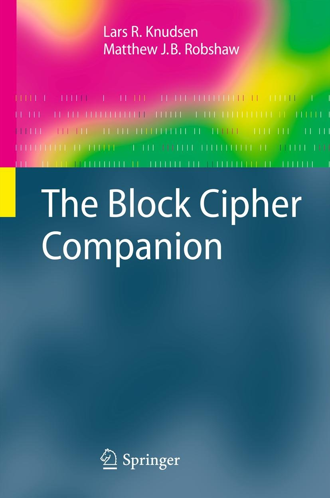
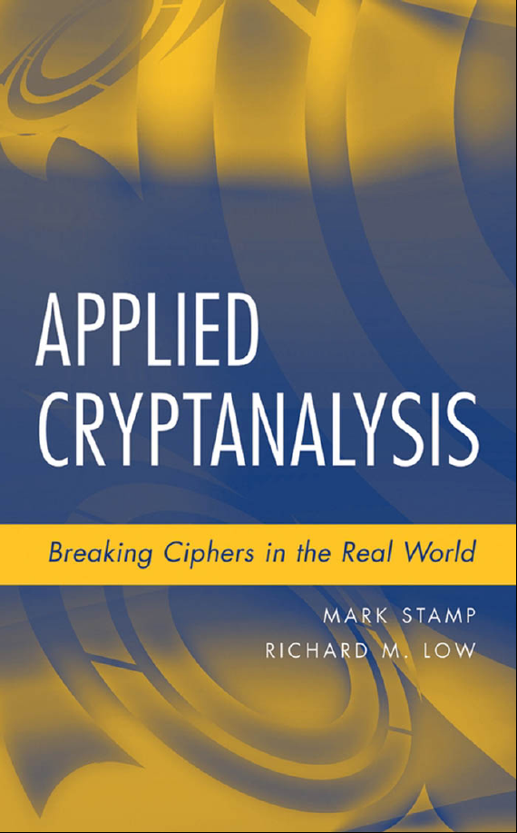
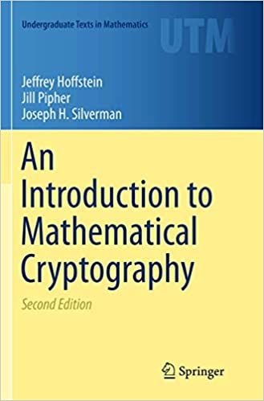
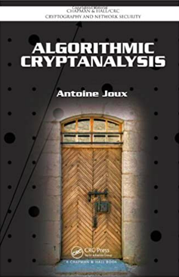

# Cryptanalysis

Learn about cryptographic attacks and how to apply this knowledge to design secure cryptographic primitives.

## Lecturer

### Ling Song

## Goals and Contents

This course aims to give you in-depth knowledge about the cryptographic attacks, focusing on cryptanalysis of symmetric ciphers. More precisely, this course covers the following topics:

* Cryptanalysis of block ciphers
  * Differential attack
  * Truncated differential attack
  * Higher order differential attack
  * Boomerang and rectangle attacks
  * Impossible differential attack
  * Linear attack
  * Multi dimensional linear attack
  * Zero-correlation linear attack
  * Algebraic cryptanalysis
  * Interpolation attack
  * Integral cryptanalysis
  * Division property
  * Meet-in-the-Middle attack
  * Demirci-Selcuk MitM attack
  * Subspace trail cryptanalysis
* Cryptanalysis of hash functions
  * Differential cryptanalysis of hash functions
  * Meet-in-the-Middle Pre-image attack
  * Todo
* Cryptanalysis of stream ciphers
  * Guess-and-determine attack on stream ciphers
  * Time-Memory-Data trade off attack
  * Cube attacks based on division property
  * Linear distinguishing and correlation attacks
  * Algebraic immunity

* Cryptanalysis of public key
  * Factoring algorithms
  * Wiener's attack on RSA
  * Lattices
  * Bleichenbacher's attack

## Material

### Slides

Todo

### Exercises

Todo

### Suggested Topics for Seminars

Todo

### Textbooks

#### The Block Cipher Companion

[Download book](./Books/The-Block-Cipher-Companion.pdf)

#### Applied Cryptanalysis: Breaking Ciphers in the Real World

[Download book](./Books/AppliedCryptanalysis-BreakingCiphersintheRealWorld.pdf)

#### An Introduction to Mathematical Cryptography

[Download book](./Books/an_introduction_to_mathematical_cryptography.pdf)

#### Algorithmic Cryptanalysis

[Download book](./Books/CRC.Algorithmic.Cryptanalysis.Jun.2009.eBook-ELOHiM.pdf)

## Administrative Information

Todo

### Evaluation

Todo

#### Exercise

Todo

#### Final Exam

Todo
